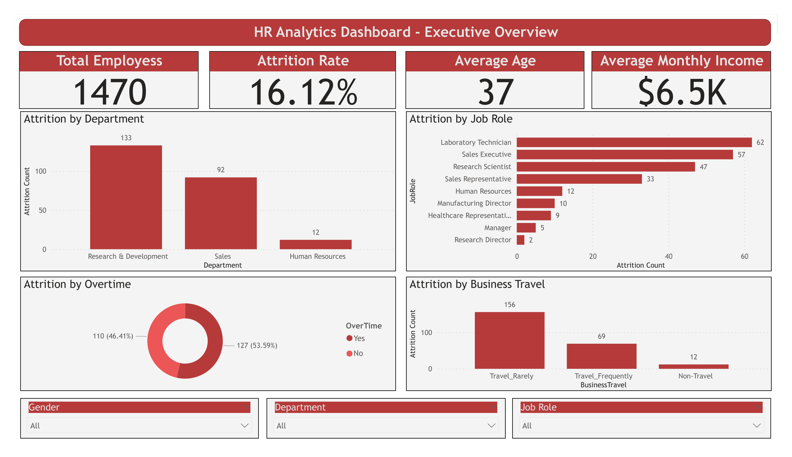
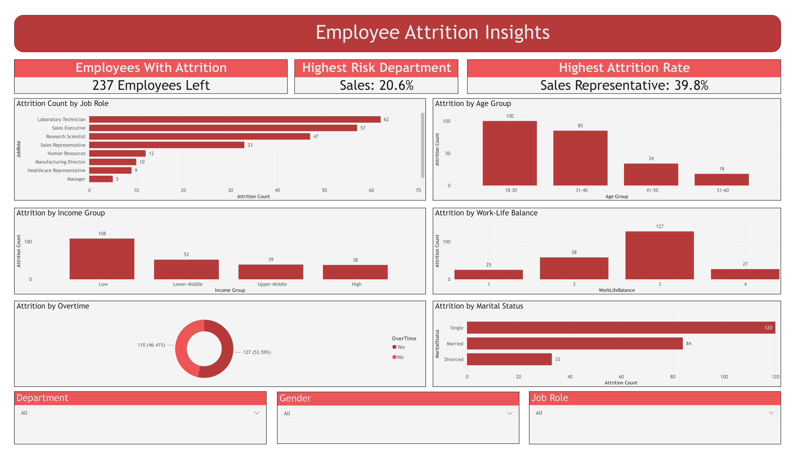
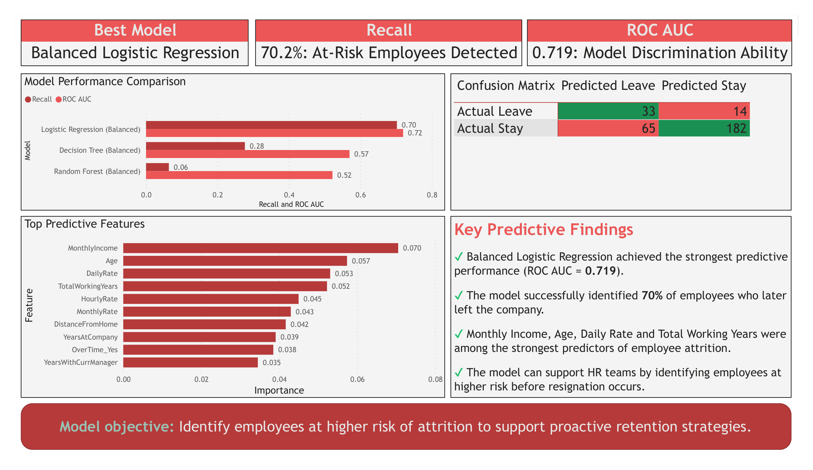
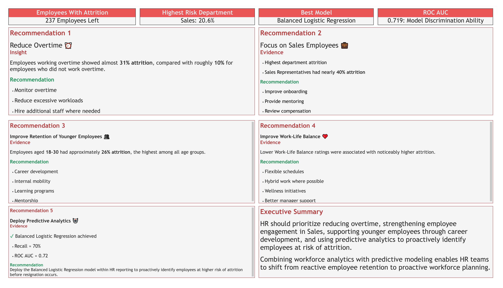

# HR Employee Attrition Analysis

## Project Overview

Employee attrition is one of the most significant challenges faced by Human Resources departments. High turnover increases recruitment and training costs, disrupts team productivity, and can negatively affect organizational performance.

This project analyzes employee attrition using the IBM HR Analytics Employee Attrition dataset. The objective is to identify the key factors associated with employee turnover through exploratory data analysis, SQL reporting, machine learning, and interactive Power BI dashboards.

The project follows a complete end-to-end analytics workflow, beginning with data cleaning and feature engineering, followed by statistical analysis, predictive modeling, SQL business queries, and executive dashboard development. The final result is a business-focused solution that enables HR managers to better understand employee turnover and supports proactive retention strategies.

---

## Business Problem

Employee resignation is costly for organizations because replacing experienced employees requires considerable time, money, and resources. Rather than reacting after employees leave, HR departments increasingly seek data-driven methods to identify employees who are at greater risk of attrition before resignation occurs.

This project investigates employee demographics, compensation, job satisfaction, work environment, overtime, tenure, and other workplace characteristics to answer several important business questions:

* Which employees are most likely to leave?
* Which departments experience the highest attrition?
* Which employee characteristics contribute most to attrition?
* Can machine learning accurately identify employees at higher risk?
* What business actions can reduce future employee turnover?

---

## Project Objectives

The objectives of this project are to:

* Perform comprehensive exploratory data analysis (EDA) to understand employee attrition patterns.
* Engineer additional business-friendly features such as age, income, tenure, and experience groups.
* Build and evaluate multiple machine learning classification models.
* Compare predictive performance using Accuracy, Precision, Recall, F1 Score, and ROC AUC.
* Conduct SQL analysis to answer common HR business questions.
* Develop an interactive four-page Power BI dashboard for executives and HR managers.
* Translate analytical findings into practical business recommendations that support employee retention strategies.

## Dataset

This project uses the **IBM HR Analytics Employee Attrition & Performance** dataset, which contains employee demographic information, compensation, job roles, work environment metrics, satisfaction scores, and attrition status.

### Dataset Summary

* **Records:** 1,470 employees
* **Features:** 35 original variables
* **Target Variable:** Attrition (Yes / No)

Additional business-friendly features were engineered during preprocessing, including:

* Age Group
* Income Group
* Tenure Group
* Experience Group
* Attrition Numeric (for machine learning)

---

## Tools & Technologies

The following technologies were used throughout the project:

| Technology   | Purpose                                              |
| ------------ | ---------------------------------------------------- |
| Python       | Data cleaning, feature engineering, machine learning |
| Pandas       | Data manipulation and analysis                       |
| NumPy        | Numerical computations                               |
| Scikit-learn | Machine learning models and evaluation               |
| SQLite       | SQL database creation and business queries           |
| SQL          | HR analytics reporting                               |
| Power BI     | Interactive dashboard development                    |
| VS Code      | Project development environment                      |
| Git & GitHub | Version control and portfolio presentation           |

---

## Repository Structure

```text
HR-Employee-Attrition-Analysis/
│
├── dashboard/
│   ├── images/
│   │   ├── Executive_Overview.png
│   │   ├── Employee_Insights.png
│   │   ├── Attrition_Risk_Prediction.png
│   │   └── Business_Recommendations.png
│   │
│   └── hr_attrition_dashboard.pbix
│
├── data/
│   ├── raw/
│   │   └── HR-Employee-Attrition.csv
│   │
│   └── processed/
│       ├── clean_hr_attrition.csv
│       └── hr_attrition.db
│
├── notebooks/
│   └── hr_attrition_analysis.ipynb
│
├── outputs/
│   ├── model_comparison.csv
│   ├── feature_importance.csv
│   └── confusion_matrix.csv
│
├── sql/
│   ├── basic_queries.sql
│   ├── advanced_queries.sql
│   └── model_metrics.sql
│
├── README.md
├── requirements.txt
└── .gitignore

```

---

## Project Workflow

The project followed a complete end-to-end data analytics pipeline:

### 1. Data Preparation

* Loaded and inspected the HR dataset
* Checked missing values and duplicates
* Performed data cleaning
* Created business-friendly categorical features

### 2. Exploratory Data Analysis

* Employee demographics
* Income analysis
* Attrition trends
* Department analysis
* Job role analysis
* Overtime impact
* Satisfaction metrics
* Correlation analysis

### 3. Machine Learning

Three classification models were developed and compared:

* Logistic Regression
* Decision Tree
* Random Forest

The models were evaluated using:

* Accuracy
* Precision
* Recall
* F1 Score
* ROC AUC

Class imbalance was addressed through balanced model training, with **Balanced Logistic Regression** selected as the final business model due to its superior recall for identifying employees at risk of attrition.

### 4. SQL Analysis

Business-oriented SQL queries were developed to answer common HR questions, including:

* Employee distribution
* Department statistics
* Job role summaries
* Attrition metrics
* Model performance storage and comparison

### 5. Dashboard Development

A four-page interactive Power BI dashboard was developed for executive reporting and HR decision-making:

* Executive Overview
* Employee Insights
* Attrition Risk Prediction
* Business Recommendations

## Exploratory Data Analysis

Comprehensive exploratory data analysis (EDA) was performed to understand employee characteristics, workplace conditions, and the primary drivers of attrition.

The analysis included:

* Employee demographic distribution
* Department and job role analysis
* Income and experience segmentation
* Overtime and work-life balance analysis
* Job satisfaction and environment satisfaction
* Correlation analysis between employee attributes and attrition

### Key Exploratory Insights

* Overall employee attrition rate was approximately **16%**.
* Employees working overtime experienced substantially higher attrition than employees without overtime.
* Sales Representatives exhibited the highest attrition rate among all job roles.
* Younger employees and employees with shorter tenure were significantly more likely to leave.
* Employees with lower monthly income showed higher attrition rates.
* Job satisfaction, work-life balance, and environment satisfaction were negatively correlated with employee attrition.

---

## Machine Learning Analysis

Three classification models were developed to predict employee attrition:

* Logistic Regression
* Decision Tree
* Random Forest

Because employee attrition is an imbalanced classification problem, additional balanced models were trained using class weighting to improve the identification of employees at risk of leaving.

### Model Evaluation Metrics

Models were evaluated using:

* Accuracy
* Precision
* Recall
* F1 Score
* ROC AUC

The Balanced Logistic Regression model produced the strongest balance between identifying employees at risk and maintaining overall classification performance, making it the preferred model for business applications where detecting potential resignations is more important than maximizing overall accuracy.

---

## SQL Business Analysis

SQLite was used to build a relational database and answer common HR business questions.

SQL analyses included:

* Employee distribution by department
* Job role summaries
* Attrition statistics
* Average salary analysis
* Employee demographics
* Business reporting queries
* Machine learning model performance comparison

These SQL scripts demonstrate how HR analytics can support operational reporting directly from a relational database.

---

# Power BI Dashboard

The project includes a four-page interactive Power BI dashboard designed for HR managers and executives.

### Executive Overview



Provides a high-level summary of employee demographics, attrition KPIs, department performance, and workforce composition.

---

### Employee Insights



Explores employee demographics, satisfaction levels, overtime, job roles, and the factors associated with employee turnover.

---

### Attrition Risk Prediction



Presents machine learning model performance, confusion matrices, feature importance rankings, and model evaluation metrics.

---

### Business Recommendations



Converts analytical findings into practical HR strategies focused on improving employee retention and supporting proactive workforce planning.

# Key Findings

The analysis identified several important factors associated with employee attrition:

* Approximately **16%** of employees in the dataset had left the organization.
* Employees working overtime experienced substantially higher attrition than employees who did not work overtime.
* **Sales Representatives** exhibited the highest attrition rate among all job roles, indicating a particularly vulnerable employee group.
* Younger employees and employees with shorter tenure were more likely to leave the company.
* Employees with lower monthly income experienced higher attrition rates than higher-income employees.
* Lower Job Satisfaction, Environment Satisfaction, and Work-Life Balance scores were associated with increased employee attrition.
* The Balanced Logistic Regression model achieved the strongest balance between identifying employees at risk and maintaining reliable predictive performance.

---

# Business Recommendations

Based on the analysis, the following actions are recommended:

### Reduce Employee Overtime

Monitor excessive overtime and redistribute workloads to reduce employee burnout and improve retention.

### Strengthen Sales Employee Retention

Develop targeted retention programs for Sales Representatives through mentoring, career development, and compensation reviews.

### Support Early-Career Employees

Provide structured onboarding, professional development opportunities, and career progression plans for younger employees and employees with shorter tenure.

### Improve Employee Experience

Increase employee engagement by investing in work-life balance initiatives, manager development, employee recognition, and workplace satisfaction.

### Adopt Predictive HR Analytics

Integrate predictive machine learning models into HR reporting to proactively identify employees at higher risk of leaving before resignation occurs.

---

# Future Improvements

Potential future enhancements include:

* Hyperparameter tuning using GridSearchCV
* XGBoost and LightGBM model comparison
* SHAP analysis for model explainability
* Employee attrition probability scoring
* Interactive HR dashboard connected to a live SQL database
* Deployment as a Streamlit or Power BI Service application

---

# How to Run the Project

1. Clone the repository.
2. Install the required Python packages:

```bash
pip install -r requirements.txt
```

3. Open the Jupyter Notebook located in the `notebooks/` folder.
4. Run the notebook from top to bottom.
5. Open the Power BI dashboard (`.pbix`) to explore the interactive visualizations.
6. Execute the SQL scripts using SQLite to reproduce the business reports.

---

# Conclusion

This project demonstrates a complete end-to-end HR analytics workflow, combining data preprocessing, exploratory analysis, SQL reporting, machine learning, and interactive business intelligence dashboards.

Rather than focusing solely on predictive modeling, the project emphasizes translating analytical results into practical business recommendations that support proactive employee retention and data-driven HR decision-making.

The workflow reflects the responsibilities of a modern data analyst by integrating technical analysis with business communication, executive reporting, and actionable insights.